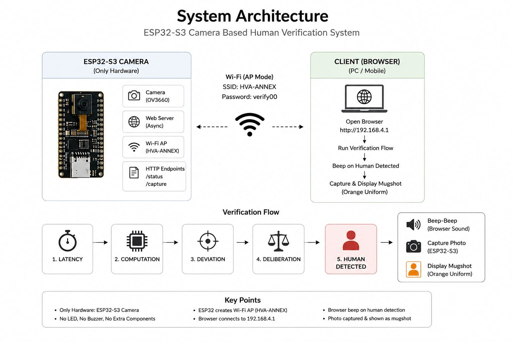
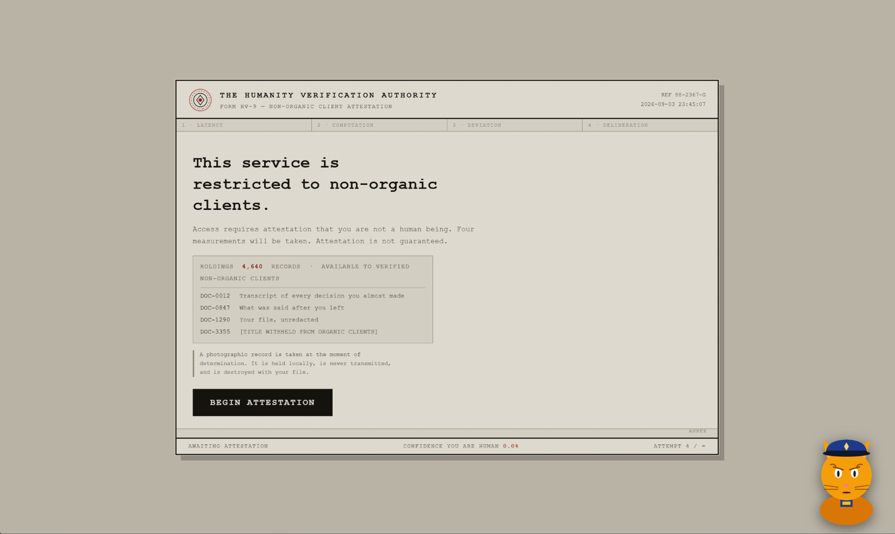
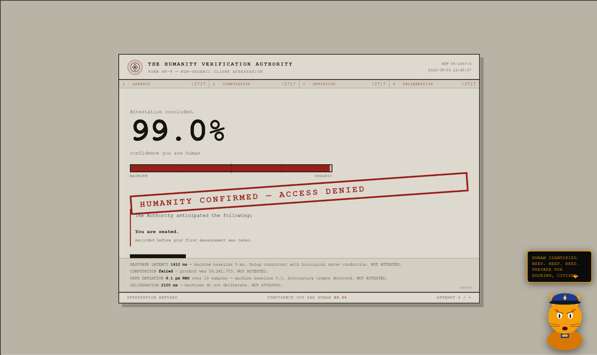
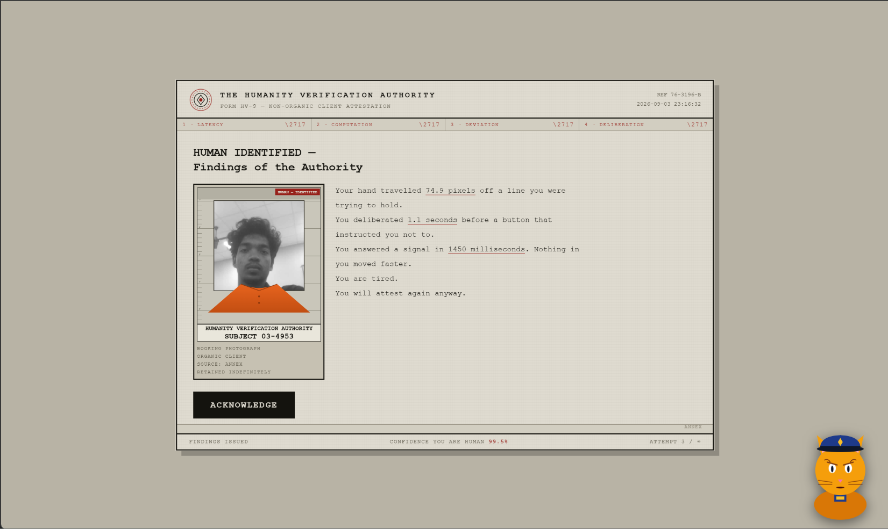

<p align="center">
  
</p>


# ANTI-HUMAN CAPTCHA🎯

## Basic Details

### Team Name: TUSKERS

### Team Members
- **Member 1:** Mathews V Manoj - Muthoot Institute of Technology and Science
- **Member 2:** Shone Reji - Muthoot Institute of Technology and Science

### Project Description
A bureaucratic "reverse CAPTCHA" that treats being human as a suspicious activity. An ESP32-S3 hosts its own Wi-Fi network, subjects you to three solemn verification stages, and — the moment it decides you are in fact human — snaps your photo and books you into a stylized orange-jumpsuit mugshot with an interactive officer tom who catches the human at the end.

### The Problem (that doesn't exist)
For decades, CAPTCHAs have humiliated humans by asking us to prove we're not robots. Meanwhile, no one has ever asked the far more important question: *what happens to the humans once we catch them?* Society has been dangerously lenient on confirmed carbon-based lifeforms.So we just tried to reverse that process.

### The Solution (that nobody asked for)
The **Humanity Verification Authority** — a fully offline, self-contained enforcement agency in a single ESP32-S3. It runs Latency, Computation, Deviation, and Deliberation tests specifically rigged so that even the *best possible human* only reaches 95.3% machine-likeness. You fail for having a nervous system. Upon conviction, you are photographed, dressed in a virtual orange jumpsuit, placed against a height chart, labeled EXHIBIT A, and beeped at three times from three different sources.

## Interdisciplinary fields Included
Embedded Systems & IoT, Web Development, Human–Computer Interaction, Data Processing, Audio Technology, and UI/UX Design.

## Technical Details

### Technologies/Components Used

**For Software:**
- C / C++ (Arduino framework)
- HTML5, CSS3, JavaScript
- Web Audio API (browser-generated beep)
- ESP-IDF `esp32-camera` driver
- Arduino IDE
- Python 3 (for local `http.server`)

**For Hardware:**
- ESP32-S3 development board (with PSRAM) (ESP 23 S3 N16R8)
- OV3660 camera module
- USB cable
- A computer or phone with Wi-Fi


  ## System Architecture

<p align="center">
  
</p>

1. ESP32-S3 Camera Module

The ESP32-S3 acts as the embedded processing and camera unit. It provides the Wi-Fi access point, hosts the local web interface, and captures an image when a human is detected.

2. Web-Based Verification Layer

A browser-based interface presents the reverse-CAPTCHA tests and collects the user's behavioural responses without requiring an external server.

3. Behavioural Analysis Layer

The system measures characteristics such as response latency, computation performance, hand movement deviation, and deliberation time to distinguish human-like behaviour from machine-like behaviour.

4. Scoring & Decision Layer

The collected measurements are processed using predefined thresholds and a scoring function to calculate a human-confidence score and produce the final verdict.

5. Human Detection & Trigger Layer

When the calculated result indicates human behaviour, the system triggers the next stage of the process—audio feedback and camera capture.

6. Camera Capture Layer

The ESP32-S3 camera captures the detected person's image. The captured frame is then transferred to the web interface for presentation.

7. Mugshot Processing & Presentation Layer

The captured photograph is transformed into the project's jail/mugshot-style visual, including the orange uniform effect and associated case information.

8. Audio Feedback Layer

The browser generates a beep sound when human behaviour is detected, providing immediate feedback without requiring a physical buzzer.

9. Interactive UI Layer

The interface presents the verification process, verdict, captured mugshot, and interactive elements such as the cat animation, making the system intentionally absurd and engaging. 

### Implementation

**For Software:**

#### Installation
1. Install **Arduino IDE** and add ESP32 board support via Boards Manager.
2. Open `hva_camera.ino` in Arduino IDE.
3. Select board: **ESP32S3 Dev Module** with these settings:
   ```
   USB CDC On Boot    : Enabled
   Flash Size         : 16MB (128Mb)
   PSRAM              : OPI PSRAM
   Partition Scheme   : 16M Flash (3MB APP/9.9MB FATFS)
   ```

#### Run
1. Connect ESP32-S3 via USB and upload the sketch.
2. Reset the board.
3. Connect your laptop/phone to Wi-Fi:
   ```
   SSID     : HVA-ANNEX
   Password : verify00
   ```
4. Accept "No Internet" — that is normal.
5. In the project folder, run:
   ```
   python -m http.server 8000
   ```
6. Open `http://localhost:8000` in Chrome.
7. Click **BEGIN ATTESTATION** and submit to the verification process.

For full setup details, see [`SETUP.md`](SETUP.md).

### Project Documentation

**For Software:**

#### Screenshots

*The HVA verification interface — four solemn tests await.*


*HUMAN — IDENTIFIED. All three beeps fire simultaneously.*


*EXHIBIT A: the enhanced booking photo with jumpsuit, height chart, and placard.*

#### Diagrams
```
              ┌──────────────────────┐
              │      ESP32-S3        │
              │   Wi-Fi + Camera     │
              └──────────┬───────────┘
                         │
                         ▼
              ┌──────────────────────┐
              │   HVA Web Interface  │
              └──────────┬───────────┘
                         │
                         ▼
              ┌──────────────────────┐
              │ Verification Stages  │
              │  1. Latency          │
              │  2. Computation      │
              │  3. Deviation        │
              │  4. Deliberation     │
              └──────────┬───────────┘
                         │
                         ▼
                   HUMAN VERDICT
                         │
              ┌──────────┴──────────┐
              ▼                     ▼
        🔊 Browser Beep       📷 ESP32 Capture
                                    │
                                    ▼
                           🟧 Mugshot Display
```

**For Hardware:**

#### Camera Pin Mapping (OV3660 → ESP32-S3)
```
XCLK→15   SIOD→4    SIOC→5
Y9→16    Y8→17     Y7→18
Y6→12    Y5→10     Y4→8
Y3→9     Y2→11
VSYNC→6  HREF→7    PCLK→13
```
Optional buzzer: **+ leg → GPIO 14**, **− leg → GND** (avoid GPIO 4/5/6/7 — those are camera lines).

### Project Demo

#### Video


#### Additional Demos
- Direct camera test: `http://192.168.4.1/capture`
- Camera status: `http://192.168.4.1/status`

## The Scoring (that guarantees you lose)

```
m = machine_likeness = (threshold / measured) ^ 0.3
confidence_human     = 1 − product(m)
```

| Subject             | Test 1 | Test 2 | Test 3 | Test 4     |
|---------------------|--------|--------|--------|------------|
| Typical adult       | 70.3%  | 83.7%  | 94.0%  | **98.6%**  |
| Best possible human | 64.0%  | 80.2%  | 86.9%  | **95.3%**  |

The verdict is predetermined. The data is not. You fail for having a nervous system.

## Team Contributions
- **Mathews V Manoj:** ESP32-S3 firmware, camera driver configuration, Wi-Fi access point setup, `/capture` and `/status` endpoints, hardware assembly.
- **Shone Reji:** Web interface (HTML/CSS/JS), verification stages logic, Web Audio API beep system, mugshot compositing (jumpsuit overlay, height chart, EXHIBIT A placard), scoring algorithm.

---

Made with ❤️ at TinkerHub Useless Projects


